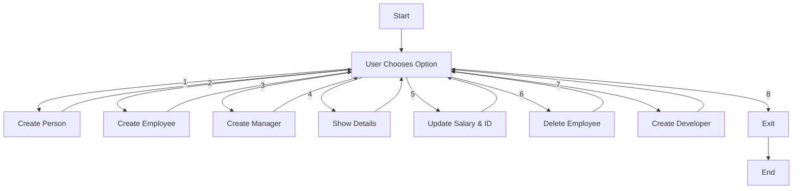

# 📘 Employee Management System (Python OOP)

## 🚀 Overview
This project is a simple **Employee Management System** built using **Object-Oriented Programming (OOP)** concepts in Python.

It demonstrates:
- Classes & Objects
- Inheritance
- Encapsulation
- Method Overriding
- Basic CLI interaction

---

## 🧩 Classes Included

- 👤 Person  
- 🧑‍💼 Employee  
- 👨‍💻 Developer (inherits Employee)  
- 🧑‍💼 Manager (inherits Employee)

---

## 🔄 Flowchart



---

## 📸 Screenshot

_(Attach your screenshot here)_  

Example:


---

## 💻 How to Run

1. Make sure Python is installed  
2. Run the script:
```bash
python OOP_Wrapper.py
```

---

## ✨ Features

- Interactive menu system 🎯  
- Multiple roles (Employee, Manager, Developer) 👥  
- Data display and updates 🔄  
- Object lifecycle demonstration (constructor & destructor) ⚙️  

---

## 📌 Notes

- This is a learning project for understanding OOP concepts  
- Some parts can be improved (validation, structure, storage)

---

## ❤️ Made for Learning
Keep exploring Python and OOP!
